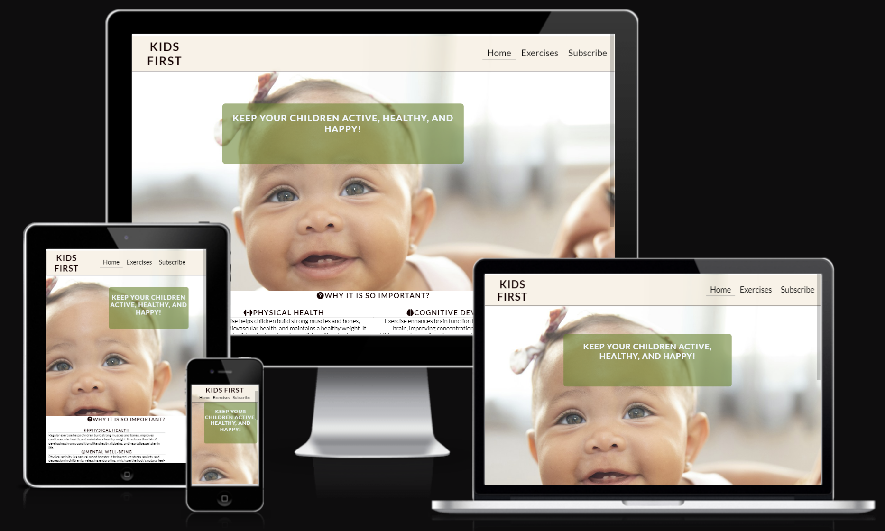

# My very first  website

Welcome! [Code Institute](http://codeinstitute.net) 

This website was created to help families, parents, and guardians in the physical development of children at home. It provides simple exercises for ages from 1 year old.

Users of this website will be able to find information about why it is so impirtant to develop children physically and what is the positive effect of physical exercises on the child's body. There is also a subscribe form in order to have access to updates that will take place on the site. The site is responsive for all screen sizes.

 

## Features
## Navigation Bar and Header
    1. Featured at the top of all three pages, the navigation links are situated to the right. 
    2. At the top left in the header section, there is a name of a company, that will take the user to the home page when clicked.
    3. On smaller screens, such as mobiles, the navigation links are centered.

## The Home page
    1. This is the landing page and with it's colourful picture of a child smiling that bring motivation to the user to take care of children's health and wellbeing.

    2. The section below conatins information on why it is so important to do exercises with children. It contains information about Physical Health, Cognitive Development, Mental Well-being and phrase that you need to Make them (children) HAPPY!
    3. There is a picture of a strong boy, to give a more inspiration.

## The Footer
    1. The footer section includes relevant links to Facebook, Instagram and Youtube.
    2. The links will open in a new tab and they aspire to give the user more motivation to take the lifechanging step.

## The Exercises page
    1. The Exercises page provides exercises that the user can do with their kids age from 1 to 3 years old, from 4 to 6 years old and from 7 to 11 years old.
    2. The page is fully responsive and have a nice backgroung. On larger screens it appears in two columns.

## The Subscribe page
    1. Background picture of a kids playing with ball. 
    2. Subscribe form allows the user to fill in the necessary contact details to easy get in touch. 
    3. Submit button is interactive and changes color when hover over it. That gives a positive user experience.

### Features left to implement
1. I would like to add and structure more exercises and videos.
2. I would like to add a webshop to the page to make it easy and fast for the users to get all equipment that they will need for future training.

# Technologies Used
## Languages Used
    1. HTML5
    2. CSS3
## Frameworks, Libraries & Programmes Used
    1. Git. Git was used for version control by utilizing the Gitpod terminal to commit to Git and Push to GitHub.
    2. GitHub. GitHub is used to store the projects code after being pushed from Git.
    3. Google Fonts. Google Fonts was used to import 'Lato', 'Oswald', 'Platypi' fonts into the style.css file which is used on all pages throughout the project.
    4. Hover.css. Hover.css was used on all external and internal links to make the website more interactive
    5. YouTube. Youtube was used to find inspiration and new interesting technologies that can be added to the site design. In particular added backdrop-filter: blur to Header to make it background look more interesting.

# User Experience (UX)
## User Stories
    1. First Time Visitor Goals
        1.1. As a First Time Visitor, I want to easily understand the main purpose of the site and learn more about the organisation.
        1.2. As a First Time Visitor, I want to easily navigate throughout the site to find content.
        1.3. As a First Time Visitor, I want to see social media and community links to see more details and video and to see whether I can trust them.
    2. Returning Visitor Goals
        2.1. As a Returning Visitor, I want to find information about events or challenges
        2.2. As a Returning Visitor, I want to easily find the best way to communicate with organisation to solve my problems that I may have and to get answesrs to my queries.
    3. Frequent User Goals
        3.1. As a Frequent User, I want to check if there are any new information/ challenges or any updated news
        3.2. As a Frequent User, I want to subscribe to the website's news, updates and any changes they will have
## Design
    1. Favicon. Favicon was created with this website [favicomatic](https://favicomatic.com/) 
    and photo for favicon was chosen here [vector4free](https://www.vector4free.com/)    
    2. CONTENT. All content was writted by the developer
    3. MEDIA. 
  

# Testing
1. The W3C Markup Validator and W3C CSS Validator Services were used to validate every page of the project ensure there were no syntax errors in the project.
2. I tested and confirmed that all internal links are working and redirecting the user between the pages.
3. I tested that all external links, to social media sites, are woking and opening in a separate tab.
4. I tested and confirmed that the contact form works, all fields are required, the email field only accepts email address, and the submit button link works.

 ## Bugs
1. There was a bug causing error on the css file when the Google fonts where imported with the @import link. Coma was missed. 
2. There was some "warning" that I dont need a slash when close the <link> tag.

### Unfixed bugs
1. No unfixed bugs

## Deployment

### Version Control
1. The site was created using Gitpod editor and pushed to Github repository.
2. Git commands were used throughout the development to push the code to the repository. The following git commands were used:
    -   git add . - to add the files to the staging area before being committed.
    -   git commit -m "commit message" - to commit changes to the local repository queue that are ready for the final step.
    -   git push - to push all committed code to the remote repository on Github.

### Deployment to Github pages
1. The site was deployed to Github pages as follows:
    -   In the Github repository, I navigated to Settings tab
    -   From the source section drop-down menu, I selected the Master branch and Save
    -   Once the Master branch was selected, the page provided the link to the website
-   The live link: [Kids First](https://inna-kot.github.io/firstProject/)

## Wireframes
1. The site was developed with the Mobile-first method. The wireframes were therefore drawn with that thought in mind, and created on a piece of paper with a simple pencil.

## Credits
1. Thanks to my Mentor for the support and answering all my Questions!
2. Thanks to tutor support at Code Institute for their support at all stages!

### Content
-   The icons in the footer and in the headings were taken from [Font Awesome](https://fontawesome.com/)   
The social media links to Facebook and Instagram are the real ones this company is using.
-   The Favicon in the Title of the page was taken from [Favicon](https://favicon.io/emoji-favicons/)
-   I took inspiration from the Love Running project to create the header, footer and contact page.
### Media
-   The images in the hero section, on the servives page and the contact page was taken from [Pexels](https://www.pexels.com/)
-   The profile picture on the Home page is from my private gallery.
-   The online coaching image on the services page, with pictures of an app, was with permission taken from [Nutrition Data](https://nutritiondata.se/)

       
    

